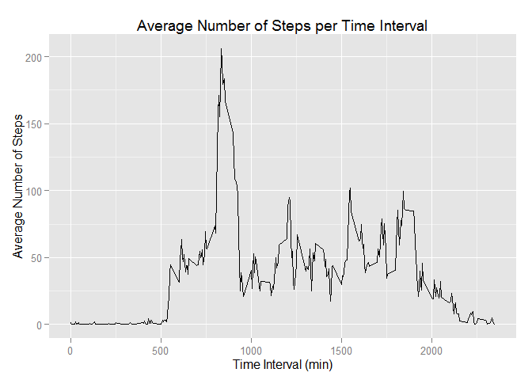
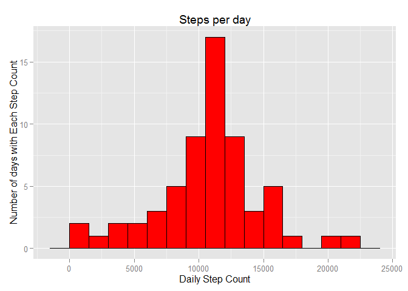
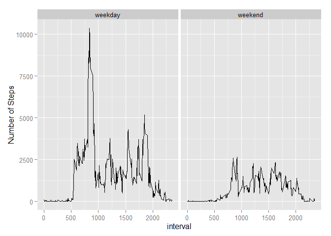

# Reproducible Research: Peer Assessment 1


## Loading and preprocessing the data

1.  Load the data

Downloaded and Unzipped file to desktop of my computer. Then uploaded the contents of the unzipped file using the function read.csv as follows:


```r
file <- read.csv("C:\\Users\\katbisho\\Desktop\\repdata-data-activity\\activity.csv")
```

2.  Process/transform the data (if necessary) into a format suitable for your analysis


```r
#create a data frame that has two columns: 
# 1. the date
# 2. the total number of steps on that specified date
steps_per_day <- aggregate(steps ~ date, data = file, FUN = sum)

#create a data frame that has two columns: 
# 1. the time interval 
# 2. the average number of steps in that time interval over all of the dates
avgsteps_per_interval <- aggregate(steps ~ interval, data = file, FUN = mean)
```

## What is mean total number of steps taken per day?

1.  Make a histogram of the total number of steps taken each day


```r
library(ggplot2)

g <- ggplot(data = steps_per_day, aes(x = steps))
g + geom_histogram(binwidth = 1500, fill = "light blue", colour = "black") + ggtitle("Steps per day") + ylab("Number of days with Each Step Count") +xlab("Daily Step Count")
```

 

2. Calculate and report the **mean** and **median** total number of steps taken per day


```r
#calculate the mean number of steps taken per day
mean_steps <- mean(steps_per_day$steps)
mean_steps
```

```
## [1] 10766.19
```

```r
#calculate the mediam number of steps taken per day
median_steps <- median(steps_per_day$steps)
median_steps
```

```
## [1] 10765
```

## What is the average daily activity pattern?
1. Make a time series plot of the 5-minute interval (x-axis) and the average number of steps taken averaged across all days


```r
library(ggplot2)

p <- ggplot(avgsteps_per_interval, aes(x = interval, y = steps))
p + geom_line() + ggtitle("Average Number of Steps per Time Interval") + ylab("Average Number of Steps") + xlab("Time Interval (min)")
```

 

2.  Which 5-minute interval, on average across all the days in the dataset, contains the maximum number of steps


```r
#Calculate the time interval with the maximum average number of steps by calculating the row with the steps = maximum number of average steps
max_steps <- avgsteps_per_interval[which(avgsteps_per_interval$steps == max(avgsteps_per_interval$steps)), ]
max_steps
```

```
##     interval    steps
## 104      835 206.1698
```

So, the maximum average number of steps per interval is 206 steps. This maximum occurs in the time interval 835.

## Imputing missing values

1.  Calculate and report the total number of missing values in the dataset


```r
summary(file)
```

```
##      steps                date          interval     
##  Min.   :  0.00   2012-10-01:  288   Min.   :   0.0  
##  1st Qu.:  0.00   2012-10-02:  288   1st Qu.: 588.8  
##  Median :  0.00   2012-10-03:  288   Median :1177.5  
##  Mean   : 37.38   2012-10-04:  288   Mean   :1177.5  
##  3rd Qu.: 12.00   2012-10-05:  288   3rd Qu.:1766.2  
##  Max.   :806.00   2012-10-06:  288   Max.   :2355.0  
##  NA's   :2304     (Other)   :15840
```

As can be seen by the summary of the data, the only column with NA's is the steps column. There is a total of 2304 NA's in the steps column. Thus, there are a total of 2304 rows with missing values in this data set.

2.  Devise a strategy for filling in all of the missing values in the dataset. 

Strategy: We will fill in the missing values with the corresponding average of steps for that time interval. 


3.  Create a new dataset that is equal to the original dataset but with the missing data filled in.


```r
#copy the original data set "file"" into another data set for alteration
newfile <- file

for(i in seq_along(newfile$steps)){
  if(is.na(newfile$steps[i])){
    #find the corresponding interval with the NA value
    time <- newfile$interval[i]
    #find the row in avgsteps_per_interval with that interval
    temp <-   avgsteps_per_interval[which(avgsteps_per_interval$interval == time),]
    #convert the NA value to the average steps value found in temp (this is the average steps fo the corresponding interval)
    newfile$steps[i] <- temp$steps
  }
}
```

4.  Make a histogram of the total number of steps taken each day and calculate and report the **mean** and **median** total number of steps taken per day. DO these values differ from the estimates from the first part of the assignment? What is the impact of imputing missing data on the estimates of the total daily number of steps.


```r
#first, create a new data frame which has the total number of steps per day
newsteps_per_day <- aggregate(steps ~ date, data = newfile, FUN = sum)

library(ggplot2)

g <- ggplot(data = newsteps_per_day, aes(x = steps))
g + geom_histogram(binwidth = 1500, fill = "red", colour = "black") + ggtitle("Steps per day") + ylab("Number of days with Each Step Count") +xlab("Daily Step Count")
```

 

```r
#Calculate the mean of the total number of steps taken per day
newmean_steps <- mean(newsteps_per_day$steps)
newmean_steps
```

```
## [1] 10766.19
```

```r
#Calculate the median of the total number of steps taken per day
newmedian_steps <- median(newsteps_per_day$steps)
newmedian_steps
```

```
## [1] 10766.19
```

```r
#Now, see if these values differ from the estimate from the first part of the assignment
dif_mean <- newmean_steps - mean_steps
dif_mean
```

```
## [1] 0
```

```r
dif_median <- newmedian_steps - median_steps
dif_median
```

```
## [1] 1.188679
```

As can be seen by the calculations above, the mean is the same between the two calculations and the median for the new data set is 1.19 steps above the median calculated in the first part of the assignment.  

As can be seen by the two different histograms, the new data set is more concentrated around the average number of steps per day. The new data set has more than 15 days with the average step count around 10,800 where as the original histogram shows there were less than 10 days with the average step count around 10,800.

Let's look at the summary of the two data sets.


```r
#data from first part of the assignment
summary(file)
```

```
##      steps                date          interval     
##  Min.   :  0.00   2012-10-01:  288   Min.   :   0.0  
##  1st Qu.:  0.00   2012-10-02:  288   1st Qu.: 588.8  
##  Median :  0.00   2012-10-03:  288   Median :1177.5  
##  Mean   : 37.38   2012-10-04:  288   Mean   :1177.5  
##  3rd Qu.: 12.00   2012-10-05:  288   3rd Qu.:1766.2  
##  Max.   :806.00   2012-10-06:  288   Max.   :2355.0  
##  NA's   :2304     (Other)   :15840
```

```r
#data with missing values imputted
summary(newfile)
```

```
##      steps                date          interval     
##  Min.   :  0.00   2012-10-01:  288   Min.   :   0.0  
##  1st Qu.:  0.00   2012-10-02:  288   1st Qu.: 588.8  
##  Median :  0.00   2012-10-03:  288   Median :1177.5  
##  Mean   : 37.38   2012-10-04:  288   Mean   :1177.5  
##  3rd Qu.: 27.00   2012-10-05:  288   3rd Qu.:1766.2  
##  Max.   :806.00   2012-10-06:  288   Max.   :2355.0  
##                   (Other)   :15840
```

As can be seen by the summaries, the date and interval columns remained the same (This makes sense since there was no missing values in those columns to change). The maximum and mean steps for the two data sets are the same. The only thing that changed was the third quartile calculation for the steps column.  

## Are there differences in activity patterns between weekdays and weekends?

NOTE: We will use the new data frame "newfile" to answer the question for this section.


```r
#vector weeday will specify the day of the week
newfile$date <- as.Date(newfile$date, format = "%Y-%m-%d")
weekday <- weekdays(newfile$date, abbreviate = TRUE)

#initiatlize the vector class
class <- vector(mode = "character", length = length(weekday))
#set class to either "Weekend" or "Weekday" based on day from weekday vector
for (i in seq_along(weekday)){
  if(weekday[i] == "Sun"){
    class[i] <- "weekend"
  }
  else if (weekday[i] == "Sat"){
    class[i] <- "weekend"
  }
  else{
    class[i] <- "weekday"
  }
}

#combine the new file, weekday, and class into one data frame called data
data <- cbind(newfile, weekday, class)

#split the data frame data into weekend and weekday
data_weekday <- data[which(class == "weekday"), ]
data_weekend <- data[which(class == "weekend"), ]

#average steps per interval in data_weekday and data_weekend
#then rbind them back together into a new data frame
data_weekdayavg <- aggregate(steps ~ interval, data = data_weekday, FUN = sum)

data_weekendavg <- aggregate(steps ~ interval, data = data_weekend, FUN = sum)

new_data <- rbind(cbind(data_weekdayavg, class = "weekday"), cbind(data_weekendavg, class = "weekend"))

#create the graph
new_data$steps <- as.integer(new_data$steps)
g <- ggplot(data = new_data, aes(x = interval, y = steps))
g + facet_grid(.~class) + geom_line() + ylab("Number of Steps")
```

 
